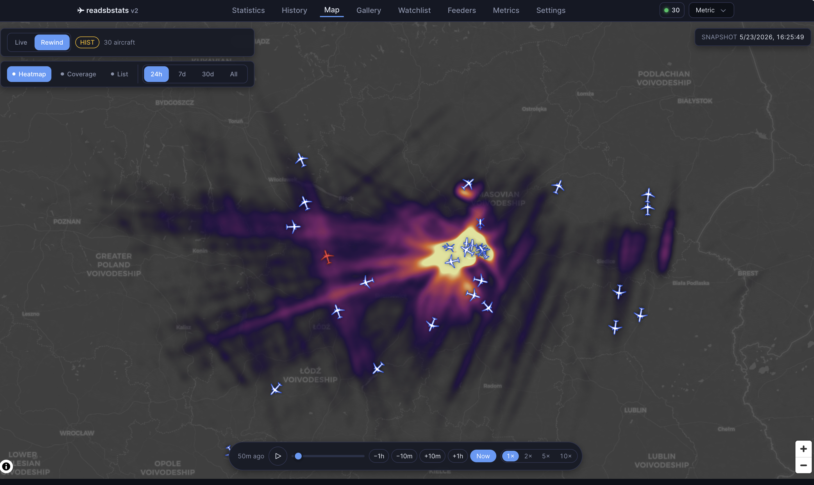
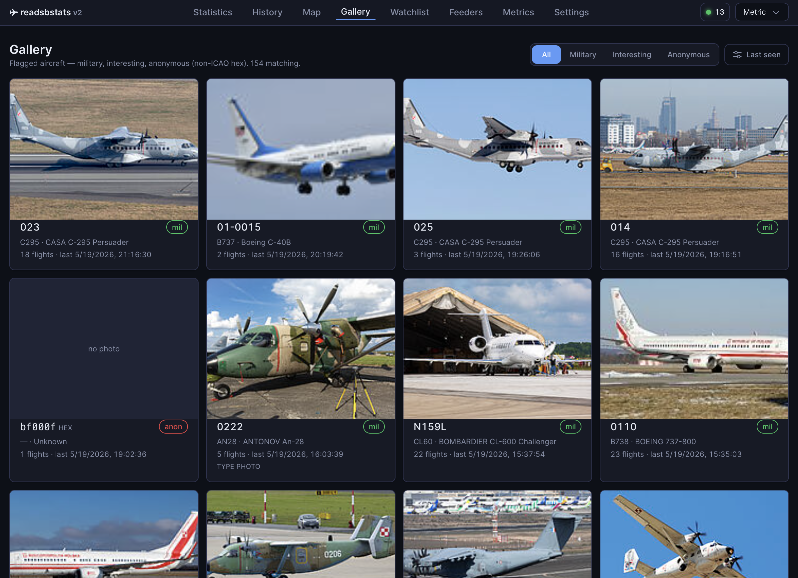
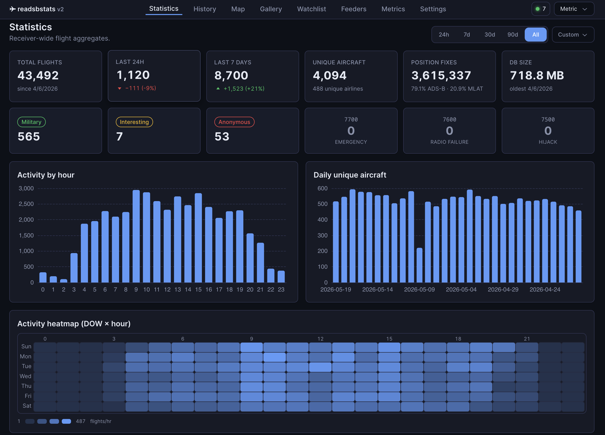
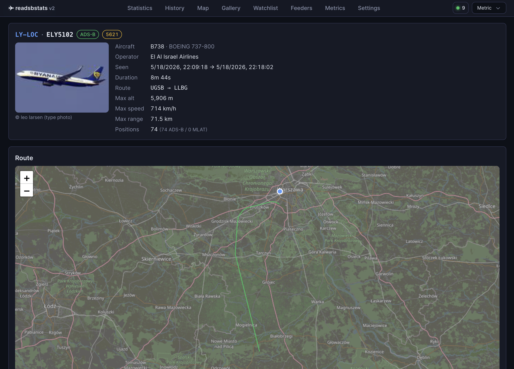
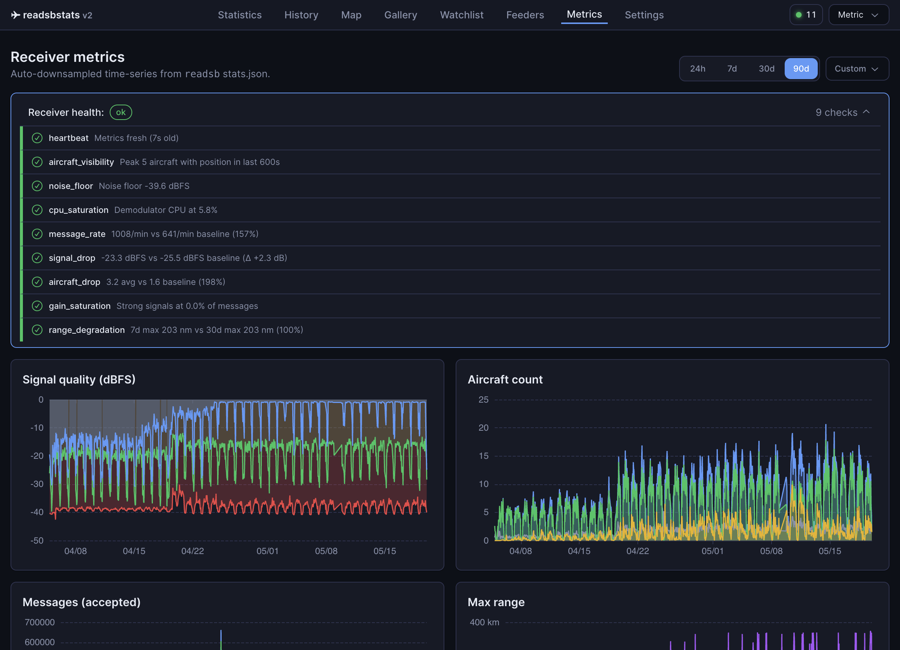
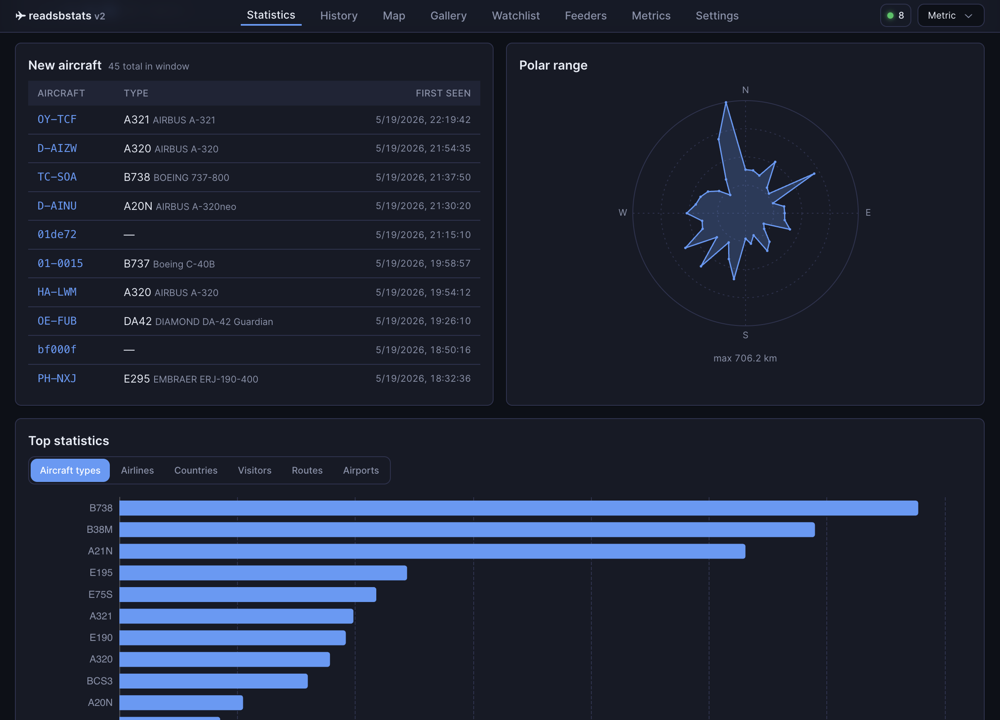

# readsbstats

[](https://github.com/blindp3w/readsbstats/actions/workflows/test.yml)
[](https://github.com/blindp3w/readsbstats/releases/latest)
[](LICENSE)

Extended flight history and track logging for [readsb](https://github.com/wiedehopf/readsb) ADS-B receivers, with a web UI for browsing historical flights and statistics.

Designed to run alongside readsb, tar1090, and feed clients on a **Raspberry Pi 4** without overwhelming it.

readsb and tar1090 give you a great live view — readsbstats adds the other half: a persistent SQLite history of every flight, a full-featured browser UI for exploring it, Telegram notifications for military and watchlist aircraft, and a receiver health dashboard backed by months of metrics.

> 🤖 **About this project:** readsbstats was entirely vibecoded with [Claude Code](https://claude.com/claude-code). Every line of code, test, and configuration in this repository was generated by AI under the maintainer's direction — not a single line was written by hand.

## Screenshots

| | |
|---|---|
|  |  |
| Live map — Live / Rewind / HIST modes, bottom command bar, position heatmap, coverage overlay | Gallery — military, interesting, and anonymous (non-ICAO hex) aircraft with photos |
|  |  |
| Statistics — summary tiles, hourly activity chart, DOW×hour heatmap, top-N datasets | Flight detail — photo, route, altitude/speed chart, full position log |
|  |  |
| Metrics — 9 health checks (baseline-aware) above 10 time-series charts (ECharts, LTTB) | Statistics — polar coverage range plot and top aircraft types, airlines, routes |

## Features

- Collects aircraft positions every 5 seconds from readsb's `aircraft.json`
- Groups positions into flights (30-minute silence gap = new flight); tracks ADS-B vs MLAT per position
- Stores everything in SQLite — no extra database server
- Aircraft enrichment: registration, type, operator from [tar1090-db](https://github.com/wiedehopf/tar1090-db) (~620k aircraft)
- Aircraft photos: Planespotters.net → airport-data.com → hexdb.io → Wikipedia type fallback; cached 30 days
- Military, interesting & anonymous (non-ICAO hex) aircraft detection, badges, and gallery
- Route enrichment via [adsbdb.com](https://www.adsbdb.com/) — origin/destination airport per flight
- Live map with **Live / Rewind / HIST** modes — rewind from "now" or jump to any moment within `map_history_hours` via a date+time picker; bottom command bar with playback scrubber, range pills, position heatmap, and coverage range overlay; responsive down to iPhone
- Telegram notifications for military/interesting/anonymous/watchlist/emergency-squawk events; interactive bot commands
- Aircraft watchlist — track by ICAO hex, registration, or callsign prefix
- Receiver metrics dashboard with 10 time-series charts (Apache ECharts canvas, cross-panel hover sync, wheel/pinch zoom, LTTB downsampling) and 9 health checks
- Optional [DuckDB](https://duckdb.org/) analytical accelerator for heatmap/coverage (`RSBS_USE_DUCKDB=1`)
- Optional **VDL2 / ACARS Messages** tab — ingest VHF Data Link Mode 2 traffic from a separate SDR via [vdlm2dec](https://github.com/TLeconte/vdlm2dec); live feed, per-aircraft view, filters, full-text search. Fully pluggable (`RSBS_VDL2_ENABLED`), stored in its own database (see [Operations](docs/operations.md#vdl2--acars-ingest))
- Unit switching: Aeronautical / Metric / Imperial — persisted in browser
- SQLite crash-safety (`synchronous=FULL` + WAL) with dirty-shutdown detection (fail-closed on corruption — see [Operations](docs/operations.md#database-integrity--startup-recovery)) and weekly/monthly integrity checks via systemd timers

## Requirements

- Raspberry Pi 4 (or any Linux machine) running Ubuntu 22.04 / 24.04
- [readsb by wiedehopf](https://github.com/wiedehopf/readsb) writing JSON to `/run/readsb/`
- Python 3.10+
- nginx (for the `/stats/` reverse proxy)

## Installation

```bash
# 1. Sync source to the Pi (from your Mac/PC)
rsync -avz --delete \
  --exclude='.git' --exclude='__pycache__' --exclude='*.pyc' \
  --exclude='.venv' --exclude='*.egg-info' \
  --exclude='docs' --exclude='db' --exclude='.DS_Store' \
  --exclude='*.db' --exclude='*.db-wal' --exclude='*.db-shm' \
  --exclude='frontend/node_modules' --exclude='frontend/.vite' --exclude='frontend/coverage' \
  --exclude='internal_docs' --exclude='.claude' --exclude='CLAUDE.md' \
  /path/to/readsbstats/ pi@your-pi:/tmp/readsbstats/

# 2. SSH into the Pi and run the installer as root
ssh pi@your-pi
sudo bash /tmp/readsbstats/scripts/install.sh
```

The installer creates a `readsbstats` system user, sets up `/opt/readsbstats/` with a Python virtualenv, creates the SQLite database, and installs systemd services.

After installation, set your receiver coordinates:

```bash
systemctl edit readsbstats-collector readsbstats-web
```

```ini
[Service]
Environment="RSBS_LAT=YOUR_LATITUDE"
Environment="RSBS_LON=YOUR_LONGITUDE"
```

Then restart services and open **`http://YOUR_PI_IP/stats/`**.

### nginx setup

Add one line to your nginx `server {}` block:

```nginx
server {
    include /opt/readsbstats/nginx-readsbstats.conf;
}
```

The conf file proxies `/stats/` to uvicorn at `127.0.0.1:8080` and serves the SPA's hashed asset bundles directly with long-cache headers.

## Security model

readsbstats has **no built-in authentication or authorization by default**. It is designed to run bound to `127.0.0.1:8080` behind nginx on a **trusted LAN**. Anyone who can reach the web port can read all flight data and call every mutating endpoint (watchlist edits, settings).

- **The `X-Requested-With` CSRF header is not authentication.** It only blocks cross-site form posts from a browser; it does not identify or authorize a caller. Do not treat it as an access control.
- **If you expose the UI beyond a trusted LAN, put an authenticating reverse proxy in front** (HTTP basic auth, an OAuth2 proxy, or a VPN/Tailscale). Do not publish `127.0.0.1:8080` directly to the internet.
- **`RSBS_API_TOKEN`** — opt-in bearer-token gate for mutating endpoints (watchlist add/delete). When set, every POST/DELETE must carry `Authorization: Bearer <token>`. Read endpoints stay open (they were already public on the trusted LAN). Useful as a thin extra layer if the app is reachable from devices you don't fully trust on the LAN; **not** a substitute for a reverse-proxy auth layer when exposed to the internet.
- Outbound HTTP (photo/route enrichment) is SSRF-guarded (`http_safe.py`) and provider photo URLs are host-allowlisted before caching (`RSBS_PHOTO_HOST_ENFORCE`) and at the API response boundary (audit 2026-05-31 PY-6).

See [Operations → Deployment security](docs/operations.md#deployment-security) for the full trust model.

## Resource usage

| Service | CPU quota | Memory limit |
|---|---|---|
| collector | 15% | 192 MB |
| web server | 50% | 1024 MB |

Database growth: ~50–150 MB/month at 5-second polling with 90-day position retention.

## Project structure

```
readsbstats/
├── src/readsbstats/            # Python package
│   ├── collector.py            # Polling daemon, flight detection, writes
│   ├── web.py                  # FastAPI app factory + lifespan + SPA-shell routes
│   ├── cache.py                # Response cache + map-cache prewarmer thread
│   ├── api/                    # Per-domain APIRouter modules
│   │   ├── _deps.py            # DB connection seam, shared SQL/allowlists, _csrf_check
│   │   ├── _photos.py          # Photo-fetch ladder + per-type async locks
│   │   ├── flights.py          # /api/flights*, /api/flights/{id}/*
│   │   ├── aircraft.py         # /api/aircraft/*, /api/airlines/*, /api/types/*
│   │   ├── stats.py            # /api/stats, /api/stats/records, /api/stats/polar
│   │   ├── map.py              # /api/map/*, /api/live
│   │   ├── feeders.py          # /api/feeders + systemd/port checkers
│   │   ├── settings.py         # /api/settings + _settings_* helpers
│   │   ├── watchlist.py        # /api/watchlist GET/POST/DELETE
│   │   ├── airspace.py         # /api/airspace
│   │   ├── health.py           # /api/health, /api/metrics, /api/metrics/health
│   │   └── dates.py            # /api/dates
│   ├── database.py             # SQLite schema, WAL, migrations
│   ├── config.py               # RSBS_* env vars
│   ├── http_safe.py            # SSRF-safe HTTP helpers (HTTPS-only)
│   ├── photo_sources.py        # Planespotters → airport-data → hexdb → Wikipedia
│   ├── notifier.py             # Telegram notifications
│   ├── analytics.py            # DuckDB accelerator (opt-in)
│   ├── health.py               # Receiver health checks
│   └── geo.py                  # haversine_nm, bearing
├── scripts/
│   ├── install.sh              # First-time installer
│   ├── update.sh               # Code sync + restart + optional DB update
│   ├── purge_ghosts.py         # One-shot: remove ghost positions
│   ├── purge_bad_gs.py         # One-shot: null implausible gs values
│   └── purge_mlat_gs_spikes.py # One-shot: null MLAT gs spikes
├── frontend/                   # React 19 + Vite 8 SPA (326 Vitest tests)
├── tests/                      # pytest (1641 tests) + Playwright UI (84 tests)
├── static/airspace/            # Bundled airspace GeoJSON
├── systemd/                    # Service + timer unit files
└── docs/                       # Public documentation
    ├── configuration.md        # All RSBS_* environment variables
    ├── api.md                  # API endpoints + database schema
    ├── integrations.md         # Telegram setup + ghost/GS filtering
    ├── operations.md           # Updating, maintenance, useful commands
    ├── development.md          # Local dev, testing, build, deploy
    ├── decisions/              # Architecture Decision Records
    └── screenshots/            # UI screenshots
```

## Documentation

| Guide | Contents |
|---|---|
| [Configuration](docs/configuration.md) | All 77 `RSBS_*` env vars, logging, DuckDB, airspace config |
| [API Reference](docs/api.md) | All API endpoints, SPA routes, database schema |
| [Integrations](docs/integrations.md) | Telegram setup, bot commands, ghost/GS filtering |
| [Operations](docs/operations.md) | Updating code, DB sync, useful commands, backups |
| [Development](docs/development.md) | Local setup, tests, build, deploy to Pi |
| [Architecture decisions](docs/decisions/) | ADRs for key technical choices |

## Contributing

Bug reports and pull requests are welcome — see [CONTRIBUTING.md](CONTRIBUTING.md) for setup and style guidelines. This project follows the [Code of Conduct](CODE_OF_CONDUCT.md).

## License

MIT — see [`LICENSE`](LICENSE).

The bundled frontend (`frontend/dist/`) includes Apache ECharts (Apache-2.0)
and other open-source libraries. Required attribution lives in
[`THIRD_PARTY_NOTICES.md`](THIRD_PARTY_NOTICES.md).
